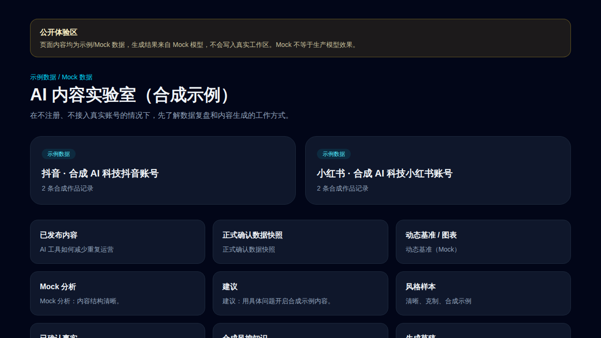

# Operations AI Platform

面向抖音与小红书运营团队的内容资产、运营数据、动态基准、分析建议、风格与事实资料、生成、风控、采集扩展、导出和恢复平台。它以“发布记录 → 数据采集 → 分析 → 人工确认 → 下一条草稿”为工程闭环，而不是替代运营判断。

> **AI 风控仅用于辅助判断，不保证通过平台审核。** 公开 Demo 使用人工合成数据，不计入真实产品指标。



## 范围与边界

- 管理内容、运营数据、动态基准、分析、建议、风格、事实资料、生成、风控、截图采集、导出与恢复。
- 不自动发布平台内容；不保存或代填平台账号密码；不保存 Cookie；不绕过验证码或平台权限；不调用非官方隐藏接口批量抓取数据。
- 默认使用 Mock LLM、Mock OCR/视觉、Mock 封面和固定 Mock Embedding。Mock 用于验证工程流程，不代表真实模型效果；当前未接入千问或其他真实计费模型。
- 公开 Demo 是独立、只读的合成工作区；真实工作区需要受控成员访问，不能把 Demo 数据、指标或资产混入其中。

## 架构与文档

Web（Next.js）只负责体验，FastAPI 集中承载工作区隔离和业务规则；Worker 处理异步任务；PostgreSQL/pgvector、Redis 和 S3 兼容对象存储分别保存数据、队列/缓存和对象。浏览器扩展只采集用户已登录并确认的受支持页面截图。

- [系统架构](docs/architecture/system.md)、[数据模型](docs/architecture/data-model.md)、[模型适配](docs/architecture/model-adapters.md)
- [部署](docs/open-source/deployment.md)、[JSON/ZIP 备份与恢复](docs/open-source/backup-restore.md)、[风控知识治理](docs/open-source/risk-knowledge.md)
- [扩展安装](docs/open-source/extension-installation.md)、[扩展隐私](docs/open-source/extension-privacy.md)、[真实页面验证状态](docs/open-source/extension-validation-status.md)
- [许可证决定](docs/open-source/license-decision.md)、[供应链安全](docs/open-source/supply-chain-security.md)、[发布清单](docs/open-source/release-checklist.md)、[第三方资产](docs/open-source/third-party-assets.md)

## Docker Compose 快速开始（Mock）

要求：Docker Desktop/Compose v2、至少 6 GB 可用内存和本地空闲端口 3000、8000、55432、9000、9001。无需模型 API Key。

```bash
cp .env.example .env
docker compose -f infra/docker/compose.yml config --quiet
docker compose -f infra/docker/compose.yml --profile demo up -d --build
curl --fail http://127.0.0.1:8000/health/ready
```

在任意浏览器访问公开 Demo 地址 `http://127.0.0.1:3000/demo`。正常停止且保留本地数据：

```bash
docker compose -f infra/docker/compose.yml --profile demo down
```

`docker compose ... down --volumes` 会删除该 Compose 项目的本地数据库、Redis 和对象存储卷；仅在确认不需要恢复本地数据时使用。生产部署、迁移、反向代理、密钥和回滚要求见[部署文档](docs/open-source/deployment.md)。

## 贡献披露与许可证

项目作者负责需求、业务判断、测试验收和迭代决策；AI 协助产品设计、代码实现、测试和文档整理。请勿声称作者独立手写了全部代码。源代码采用 [Apache-2.0](LICENSE)，但容器镜像、第三方依赖与示例资产各自遵循其许可和发布限制。

贡献前请阅读[贡献指南](CONTRIBUTING.md)、[行为准则](CODE_OF_CONDUCT.md)与[安全政策](SECURITY.md)。本仓库尚未完成真实平台、Windows/Edge 或生产承载验证，不对这些能力作宣传或保证。
