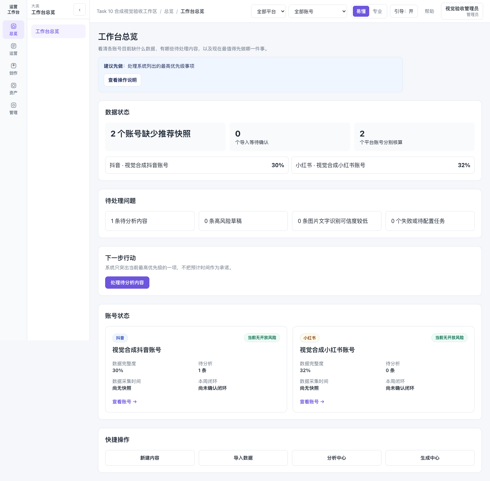

# 运营内容智能分析与生成平台

一个面向抖音和小红书运营团队的一体化工作台。它把分散在表格、文档、聊天记录和不同 AI 工具里的账号资料、内容数据与创作流程集中起来，帮助运营人员更快看清问题、复用有效经验，并完成下一条内容。

平台围绕一条可持续复盘的运营闭环设计：

**记录已发布内容 → 导入运营数据 → 分析表现与问题 → 沉淀爆款、风格和事实资料 → 生成下一条草稿 → 发布前检查 → 继续回收数据。**

你可以用它：

- 分开管理抖音与小红书账号、栏目、活动、内容和数据快照；
- 找出待分析内容、异常数据和当前最值得优先处理的事项；
- 将确认过的爆款结构、账号风格和事实资料复用于 AI 创作；
- 生成标题、文案和封面，并在保存前执行事实与风险检查；
- 通过浏览器扩展采集已登录创作者页面的截图，识别后再由人工确认；
- 可选接入 TikHub，在作品发布后定时回收抖音和小红书公开互动数据；
- 使用自带 API Key 的模型配置和可保存记录的运营智能体；
- 导出 CSV、单条分析报告和 JSON 结构化数据。

它是帮助运营人员完成判断与执行的工具，不会代替运营人员做最终决策，也不会自动发布内容。

> **AI 分析与风控仅用于辅助判断，不保证内容表现或通过平台审核。** 公开 Demo 使用人工合成数据和 Mock 结果，不代表真实运营效果。



## 范围与边界

- 管理内容、运营数据、动态基准、分析、建议、风格、事实资料、生成、风控、截图采集、导出与恢复。
- 不自动发布平台内容；不保存或代填平台账号密码；不保存 Cookie；不绕过验证码或平台权限。可选 TikHub 适配器仅读取公开作品数据，使用者需自行确认合规性与费用。
- 默认使用 Mock LLM、Mock OCR/视觉、Mock 封面和固定 Mock Embedding。可选千问适配器仍为 `experimental`，只完成 Mock/Fake 工程合同验证，尚未执行真实 API 验收；默认配置不会访问或计费。
- 公开 Demo 是独立、只读的合成工作区；真实工作区需要受控成员访问，不能把 Demo 数据、指标或资产混入其中。

## 架构与文档

推荐的轻量版由 Next.js、FastAPI 和 PostgreSQL/pgvector 三个常驻容器组成。任务在 API 进程内执行，截图和生成文件写入本地 Docker 卷，不需要 Redis、MinIO 或独立 Worker。完整版的队列、对象存储和高级治理代码仍保留，适合后续按需启用。浏览器扩展只采集用户已登录并确认的受支持页面截图。

- [系统架构](docs/architecture/system.md)、[数据模型](docs/architecture/data-model.md)、[模型适配](docs/architecture/model-adapters.md)、[千问配置与用量治理](docs/open-source/qianwen-model-configuration.md)
- [轻量部署](docs/open-source/lite-deployment.md)、[完整版部署](docs/open-source/deployment.md)、[备份恢复边界](docs/open-source/backup-restore.md)
- [TikHub 公开作品数据采集](docs/open-source/public-data-collection.md)
- [扩展安装](docs/open-source/extension-installation.md)、[扩展隐私](docs/open-source/extension-privacy.md)、[真实页面验证状态](docs/open-source/extension-validation-status.md)
- [许可证决定](docs/open-source/license-decision.md)、[供应链安全](docs/open-source/supply-chain-security.md)、[发布清单](docs/open-source/release-checklist.md)、[第三方资产](docs/open-source/third-party-assets.md)

## Docker Compose 快速开始（轻量 Mock）

要求：Docker Desktop/Compose v2、建议至少 2 GB 可用内存和本地空闲端口 3000、8000。无需模型 API Key。

```bash
cp .env.example .env
docker compose -f infra/docker/compose.lite.yml config --quiet
docker compose -f infra/docker/compose.lite.yml build api
docker compose -f infra/docker/compose.lite.yml build web
docker compose -f infra/docker/compose.lite.yml up -d --no-build
curl --fail http://127.0.0.1:8000/health/ready
```

在任意浏览器访问公开 Demo 地址 `http://127.0.0.1:3000/demo`。正常停止且保留本地数据：

```bash
docker compose -f infra/docker/compose.lite.yml down
```

`docker compose ... down --volumes` 会删除该 Compose 项目的数据库和本地文件卷；仅在确认不需要恢复数据时使用。轻量版限制和实测资源见[轻量部署文档](docs/open-source/lite-deployment.md)。

## 贡献披露与许可证

项目作者负责需求、业务判断、测试验收和迭代决策；AI 协助产品设计、代码实现、测试和文档整理。请勿声称作者独立手写了全部代码。源代码采用 [Apache-2.0](LICENSE)，但容器镜像、第三方依赖与示例资产各自遵循其许可和发布限制。

贡献前请阅读[贡献指南](CONTRIBUTING.md)、[行为准则](CODE_OF_CONDUCT.md)与[安全政策](SECURITY.md)。本仓库尚未完成真实平台、Windows/Edge 或生产承载验证，不对这些能力作宣传或保证。
