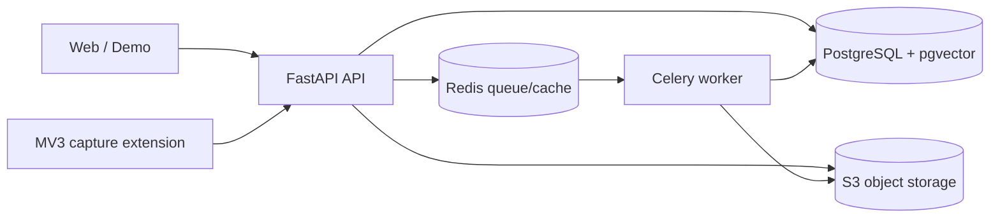

# 系统架构

这是模块化单体：Web 不复制业务规则，API 是唯一业务边界，Worker 只消费已授权的异步任务。当前部署目标是本地/受控环境的 Docker Compose，不应据此推断高可用或生产承载能力。

请求以工作区上下文进入 API；平台、账号、工作区三层过滤贯穿查询。扩展只上传用户确认的截图和必要元数据，不能读取 Cookie 或绕过验证码。上传先进入对象存储和暂存/人工确认；分析、生成、风控、导出和恢复经后台任务执行。分析引用数据/知识证据，生成通过事实和风控复检，导出/恢复采用版本化 manifest 与校验和。

PostgreSQL 保存结构化状态与向量，Redis 保存队列/缓存，S3 保存封面、截图、资料和受控备份。对象使用短期签名访问；密钥只在服务端加密存储。Demo 是标记为合成、只读且 analytics-ineligible 的独立工作区，绝不能读取或写入真实工作区。

Compose 中 migration、bucket 初始化、Demo seed 是一次性服务；API readiness 同时检查 PostgreSQL、Redis 与 S3。API/Web 运行为非 root、只读根文件系统、最小端口暴露；数据服务默认绑定 loopback。
