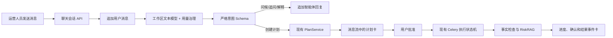

# 通用模型接入与运营智能体对话界面设计规格

日期：2026-08-12

状态：用户已批准开发

## 1. 背景与范围

千问官方 API Key 已通过一次受控真实文本调用。下一阶段同时完成两项已确认需求：

1. 在保留千问官方固定配置的同时，允许开源使用者接入自备的 OpenAI 兼容文本模型 API，并在保存后测试连接。
2. 将现有运营智能体改为类似 Codex 的对话式入口，聊天记录能够按工作区和成员持久化、恢复和继续使用。

两个需求共用现有模型配置、用量治理、运营智能体计划、运行、确认、事实检查和 RiskRAG 能力。不得另建第二套执行真相或绕过现有权限和发布前门禁。

## 2. 方案比较与决策

### 2.1 模型接入

| 方案 | 优点 | 缺点 | 决策 |
| --- | --- | --- | --- |
| 只增加更多厂商预设 | 安全、合同明确 | 每增加厂商都要发版，不能满足自备任意兼容 API | 不采用 |
| 通用 OpenAI 兼容文本适配器 | 覆盖常见开源网关和云厂商，复用现有结构化输出 | 只能承诺兼容协议，不能保证全部模型行为一致 | 采用 |
| 完整插件式 Provider SDK | 可覆盖文本、图片、OCR、Embedding 和私有协议 | 范围过大，会引入不受控代码和第二套插件安全问题 | 后续再评估 |

第一版“任意模型”明确指：管理员能够配置一个满足 OpenAI Chat Completions 与 Models 基础合同的文本模型。视觉、OCR、Embedding 和图片生成继续使用固定 Catalog，不宣传为通用兼容。

### 2.2 智能体对话

| 方案 | 优点 | 缺点 | 决策 |
| --- | --- | --- | --- |
| 只改前端外观，记录放浏览器 | 开发快 | 换浏览器丢失，无法可靠恢复 | 不采用 |
| 服务端会话与消息 + 严格意图路由 + 现有状态机 | 对话自然、记录可恢复、执行边界不变 | 需要新增数据库和 API | 采用 |
| 引入 LangGraph 或通用 Agent OS | 生态丰富 | 与现有 Celery、租约、fencing 和确认状态机重复 | 不采用 |

## 3. 通用 OpenAI 兼容模型

### 3.1 配置入口

工作区设置中的模型页面提供两类文本配置：

- `千问官方`：继续使用服务端固定官方端点和固定 Catalog。
- `OpenAI 兼容`：管理员填写配置名称、HTTPS 服务地址、模型 ID 和 API Key。

普通模式使用运营人员能理解的名称；专业模式显示 Provider、模型 ID、合同版本和安全状态。API Key 保存后立即清空且永不回显。Editor 和 Viewer 只能查看安全状态，不能查看或修改服务地址、模型 ID 和密钥。

同一工作区同一 capability 只允许一个当前生效配置。保存新文本配置后，已有运行继续使用任务创建时固定的配置版本；新任务使用新配置。

### 3.2 服务地址安全

通用配置不等于允许任意网络请求。服务端必须：

1. 只接受 `https://`；开发环境可额外接受 `http://localhost`、`127.0.0.1` 和 IPv6 loopback。
2. 拒绝用户名密码 URL、query、fragment、反斜杠、编码绕过和非 HTTP(S) 协议。
3. 规范化并保存基础路径，例如 `https://example.com/v1`。
4. DNS 解析后拒绝私网、回环、链路本地、组播、保留地址和云元数据地址；连接后再次核对实际 peer IP。
5. 禁止重定向；只允许适配器拼接固定的 `/models` 与 `/chat/completions`。
6. 服务地址不进入普通日志、错误正文、公开读取响应或轻量备份；页面只读取脱敏后的主机显示。

### 3.3 连接测试

“测试连接”调用固定的 `GET {base_url}/models`，最多一次，不发送 Prompt 或运营数据，不产生模型生成费用。成功必须同时满足：

- 鉴权成功；
- 返回合法 OpenAI Models 结构；
- 配置的模型 ID 出现在结果中。

失败只返回稳定错误码：鉴权失败、连接超时、服务不可达、模型不存在、响应不兼容或目标地址不安全。不得返回供应商原始正文、API Key 或完整服务地址。

千问官方继续使用现有无模型调用连接探针。页面明确区分“连接测试通过”和“真实生成已验证”；连接成功不能被宣传为模型效果或生产兼容性通过。

### 3.4 文本调用合同

新增 `OpenAICompatibleTextProvider`，只支持 `Capability.TEXT`：

- 固定调用 Chat Completions；
- 请求使用服务端系统策略、非流式响应和 JSON Object 结构化输出；
- 不发送供应商私有参数，如 `enable_thinking`；
- 严格解析一次 JSON 并通过 Pydantic Schema；不提取 Markdown、不自动修复、不强制类型转换；
- 401/403 不重试，429/超时/5xx 最多重试一次；
- 日志只记录脱敏 Provider 标识、模型 ID、请求 ID、token、耗时、次数和稳定错误码。

若兼容服务不支持 `response_format=json_object`，配置标记为不兼容，不能静默降级为自由文本，因为现有分析、生成和智能体都依赖严格结构化输出。

### 3.5 用量与费用

通用 Provider 继续执行并发、RPM、每日请求数和每日 token 上限。由于开源系统无法可靠知道任意供应商价格：

- 费用字段显示“由供应商结算，平台无法计算”；
- 不伪造人民币金额，也不承诺费用上限；
- 每次 attempt 仍记录输入、输出 token、状态和 `pricing_version=provider-managed-unknown`；
- 管理员必须明确确认“费用由 API 供应商直接收取”。

千问官方继续使用现有价格表和人民币微单位预算。Demo 永远只使用 Mock。

## 4. 运营智能体对话界面

### 4.1 信息架构

`/workspaces/{workspace_id}/agent` 保留同一路由，桌面端改为三部分：

1. 左侧会话栏：新建会话、最近会话、归档入口。
2. 中间消息区：用户消息、智能体回复、计划卡、运行进度卡、确认卡和结果卡按时间排列。
3. 底部输入区：多行输入、发送按钮、当前平台账号范围和用量提示。

移动端以单列聊天为主，会话栏通过抽屉打开。复杂确认继续显示电脑端提示。易懂模式只使用运营术语；专业模式补充 plan、run、tool、模型与合同版本。

### 4.2 会话与消息

新增：

- `agent_chat_sessions`：工作区、创建成员、标题、状态、当前平台/账号范围、最近消息时间、当前 plan/run 引用。
- `agent_chat_messages`：工作区、会话、顺序号、角色、消息类型、正文、状态、plan/run/confirmation/artifact 引用和创建时间。

规则：

1. 会话属于一个工作区和创建成员；成员只能读取自己的聊天记录。
2. 计划、运行和产物仍沿用现有工作区权限，可被有权限成员从正式业务页查看。
3. 消息追加写入，不覆盖历史；重试通过工作区级幂等键避免重复消息和重复模型调用。
4. 会话标题由第一条用户消息确定性截取生成，不额外调用模型。
5. 第一版支持新建、列表、继续和归档；不做全文搜索、共享聊天、永久删除和自定义保留期。
6. 工作区删除时级联删除；完整 ZIP 备份恢复会带上聊天会话和消息，轻量 JSON 备份不包含聊天正文。
7. 单条消息限制 4,000 字符；模型上下文只发送最近 12 条、总计最多 12,000 字符，避免无限增长和费用失控。

### 4.3 对话编排

聊天不是任意工具机器人。每次用户消息经过固定的 `AgentChatTurnService`：

1. 校验成员、会话、平台和账号范围。
2. 先追加用户消息。
3. 调用工作区当前文本模型，要求输出严格结构：`intent`、`reply`、`objective` 和可选 `needs_account`。
4. `intent` 只允许：
   - `greeting`：问候和能力说明；
   - `clarify`：缺少账号或目标时追问；
   - `create_plan`：将确认后的 objective 交给现有 `PlanService`；
   - `explain_state`：解释当前计划、运行、确认或结果。
5. 模型不能返回工具名、SQL、URL、Shell、邀请码、密钥或执行参数；这些字段即使出现也会被严格 Schema 拒绝。
6. `create_plan` 只创建现有不可变草稿计划，并在消息流中插入计划卡。用户必须点击“批准并开始”，执行路径仍走现有 API。
7. 运行状态、确认请求和产物由服务端业务记录投影成事件卡；聊天消息不能改变这些状态。

当模型未配置、用量政策缺失、预算或 token 上限触发、供应商失败时：用户消息仍保存；系统追加一条不包含供应商正文的安全失败消息，提供“前往模型设置”或“重试”操作。不会回退 Mock，也不会重复计费式自动重试。

### 4.4 聊天 API

新增工作区隔离接口：

```text
POST /v1/workspaces/{workspace_id}/agent/chats
GET  /v1/workspaces/{workspace_id}/agent/chats?page=...
GET  /v1/workspaces/{workspace_id}/agent/chats/{chat_id}?before=...
POST /v1/workspaces/{workspace_id}/agent/chats/{chat_id}/messages
POST /v1/workspaces/{workspace_id}/agent/chats/{chat_id}/archive
```

Viewer 可以查看自己已有的会话和正式执行结果，但不能发送消息、创建计划或批准操作。Editor/Admin 可以新建会话、发送消息和执行其现有权限允许的动作。Demo 使用独立合成会话和 Mock，不读取私有聊天。

跨工作区、其他成员会话、平台不匹配账号统一返回 404。所有写接口要求 CSRF 和幂等键。

### 4.5 页面交互

- 空状态展示三个运营示例，不把专业术语当主文案。
- 输入“你好”时，智能体进行简短问候并说明能帮助分析账号、生成优化计划和检查风险，不自动创建计划。
- 输入明确运营目标且已经选择账号时，回复一段简短理解，并展示“待批准计划”卡。
- 计划卡、确认卡和结果卡直接复用现有状态与操作，不复制业务逻辑。
- 刷新、关闭浏览器或重启 Docker 后，从服务端恢复相同会话和消息。
- 新建会话不会取消或删除旧运行；旧运行可以从对应历史会话继续查看。

## 5. 数据流



## 6. 安全与隐私

1. API Key 只在 Adapter 边界解密；聊天 API、浏览器、日志和备份不得获得密钥。
2. 聊天正文属于用户数据，不进入结构化运维日志、产品埋点、安全错误或低敏导出。
3. 对话历史不能跨成员、工作区或 Demo 边界。
4. 通用 Provider 只获得当前对话的有界消息，不获得 Cookie、邀请码、其他成员聊天、知识正文或数据库自由访问权。
5. 服务端工具注册表、角色权限、计划批准、动作确认、事实门禁和 RiskRAG 的优先级高于模型输出。
6. 任何供应商 Prompt Injection 只能产生无敏感正文的安全诊断，不能修改模型端点、账号范围、工具目录或计划批准状态。

## 7. 迁移与兼容

- 新增 Alembic 迁移，不修改历史迁移。
- 现有千问 `ModelConfig`、分析、生成、RiskRAG 和运营智能体运行继续可读。
- 旧 `/agent` 页面使用现有最新 plan/run 形成首次会话提示，但不伪造历史聊天消息。
- OpenAPI 和生成 TypeScript 类型同步更新并做漂移检查。
- Docker Fresh Install、正常重启和现有持久化卷迁移均需验证。

## 8. 非目标

第一版不实现：

- 任意厂商的视觉、OCR、Embedding 或图片协议。
- 任意代码、MCP、Shell、浏览器控制或自由网络工具。
- 自动发布、评论、私信或永久删除。
- 多人共享同一聊天、全文搜索、文件附件、语音输入。
- 流式 token 输出；第一版先使用完整结构化回复，避免半截消息与执行状态不一致。
- 由本产品充值、代付、售卖模型额度或承诺任意供应商费用上限。

## 9. 验收标准

1. Admin 可以保存一个安全的 OpenAI 兼容文本配置，读取时看不到 API Key 和完整端点。
2. 安全的 `/models` 连接测试能区分成功、鉴权失败、模型不存在、响应不兼容和 SSRF 目标。
3. 通用文本模型可通过严格 JSON 合同驱动现有分析、生成和聊天；失败不回退 Mock。
4. 自定义 Provider 调用执行并发、速率、请求和 token 上限，并明确费用由供应商结算。
5. 用户可以新建会话、发送“你好”、收到自然回复，刷新和重启后历史仍在。
6. 明确目标可以生成现有不可变计划；未批准前不执行，批准后复用现有运行状态机。
7. 聊天消息不能伪造计划、运行、确认、风险和产物状态。
8. Viewer 只读，其他成员聊天返回 404，Demo 与私有数据隔离。
9. 390px 下可完成会话切换、消息查看、发送和普通计划批准。
10. API、Web、迁移、OpenAPI、类型检查、密钥扫描、Fresh Install 和重启恢复全部通过；真实外部 API 只在用户明确授权和限定预算下验收。
